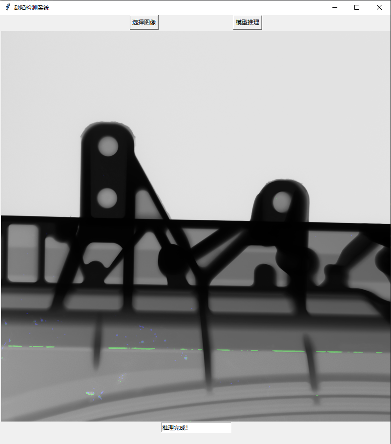

# X-Ray铸件缺陷检测


## Installation


环境要求：
* Linux 环境 Python 版本 >= 3.7
* [PyTorch](https://pytorch.org/get-started/locally/) 版本 >= 1.5，转onnx模型环境需要Pytorch版本 >= 1.5
* 安装匹配 PyTorch 版本的 [torchvision](https://github.com/pytorch/vision/) 库
* GCC 版本>= 5.4
* ONNX 版本 = 1.9.0

网络模型

网络模型使用Unet作为主体架构，具体参考core/models/unet.py

## Code Structure
```
.{SEG_ROOT}
├── core 
│   ├── data                # 读取数据以及预处理相关脚本
│   └── models              # 模型相关脚本
│   └── nn                  # 模型相关脚本
│   └── utils               # 训练相关脚本，包括损失函数，优化器等
├── docs                    # 相关文档
├── scripts
│   ├── eval.py             # 模型评估
│   └── train.py            # 模型训练
│   └── visualize.py        # 可视化结果
│   └── postprocess.py      # 后处理脚本
│   └── preprocess.py       # 预处理脚本
│   └── pth2onnx.py         # 模型转化脚本
│   └── infer.sh            # 推理脚本
```


## Datatset download
首先进入到和代码同级目录下
```
mkdir data
cd data
```
将下载下来的数据集放入data目录下，
点击[下载链接](https://pan.baidu.com/s/1QoLQkn7ZmHjgj6Ts92d52g?pwd=mnfg)即可下载

注：数据集采用VOC格式，并且铸件缺陷图像均采集自一线制造业，并且目前X-Ray铸件开源数据集较少，并且存在铸件类别，图像数量都非常少，图片分辨率较低的缺点，相反，我们的数据集分辨率非常大，铸件种类丰富，且图像数量充足。在我们的数据集中图像分辨率均为 3072×3072，若使用其他数据集的话需要注意这一点。

## [获取ais_infer工具 (310环境下)](https://gitee.com/ascend/tools/tree/master/ais-bench_workload)
```
首先进入和当前XRay同级目录下
git clone https://gitee.com/ascend/tools.git
cd tools/ais-bench_workload/tool/ais_infer/backend/
pip3 wheel ./
pip3 install ./aclruntime-0.0.2-cp37-cp37m-linux_x86_64.whl  # aclruntime版本与自己路径下的版本对应
```
如果安装提示已经安装了相同版本的whl，请执行命令请添加参数"--force-reinstall"

## Usage
-----------------
<br/>

### 910训练
<br/>

- **Single NPU training**
```
python3 train.py --data_dir ../../data/XRay_casting_voc --experiment_name exp
```

- **Single NPU eval**
```
python3 eval.py --data_dir ../../data/XRay_casting_voc --weight ../checkpoints/exp/best_model_miou.pth
```

- **可视化**
```
python3 visualize.py --data_dir ../../data/XRay_casting_voc --weights_dir ../checkpoints/exp/best_model_miou.pth --experiment_name exp
```
可视化结果在scripts同级目录下的results/exp
```
.{results/exp}
├── test_results            #只包含缺陷的可视化结果，不包含原图，所有缺陷当作一个类别
├── test_results_multi      #只包含缺陷的可视化结果，不包含原图，缺陷分类别展示
├── vis_pred                #缺陷在原图上的可视化结果，更利于观察
├── vis_results             #缺陷在原图上的可视化结果，并且包含ground truth，更便于分析
```
<br/>

### 310推理

<br/>


- **导出onnx模型**
```
python3 pth2onnx.py --weight ../checkpoints/exp/best_model_miou.pth --output_file best_model_miou.onnx
```

- **onnx模型转om**
```
atc --framework=5 --model=best_model_miou.onnx --output best_model_miou --input_format=NCHW  --log=debug --soc_version=Ascend310
```
- **om模型推理（分步操作）**

1.数据集预处理
```
python3 preprocess.py --dataset_dir ../../data/XRay_casting_voc --save_path ./bin
```

2.模型推理

```
mkdir new_result
python3 /home/xxx/tools/ais-bench_workload/tool/ais_infer/ais_infer.py --model ./best_model_miou.om --input "./bin" --batchsize 1 --output new_result/
```

3.数据集后处理
```
cd new_result
mv 2022_10_16-15_10_22/ bs1    #该日期对应自己的日期
cd ..
python3 postprocess.py --resdir new_result/bs1 --labeldir bin_mask/
```
- **om模型推理（单步操作）**

将数据集预处理、模型推理和数据集后处理放在一起，包含三个参数，三个参数分别对应数据集路径，二进制文件路径，om模型路径，路径名称与分步操作中一致
```
sh infer.sh ../../data/XRay_casting_voc ./bin ./best_model_miou.om
```

测试结果

| PixAcc      | mIOU   |
|-------------|--------|
|   99.1      | 37.6   |

推理速度：1.347 s/img

PixAcc (Pixel Accuracy) 即像素准确率，预测像素的准确率高低的评价标准。PixAcc = 预测正确像素个数 / 总预测像素个数。

mIoU (Mean Intersection over Union) 即均交并比，在语义分割的问题中，单类的交并比就是该类的真实标签和预测值的交和并的比值。


### Windows前端可视化+310后端推理

<br/>

- **部署310 sever端**
```
python3 sever.py --model best_model_miou.om --ais_infer_dir /home/user/tools/ais-bench_workload/tool/ais_infer/ais_infer.py --data_dir /home/user/sever_data
```

注意代码需要调用310的推理代码库，因此需要将推理代码的路径--ais_infer_dir作为输入参数。  

- **部署windows client端**
首先安装windows端的依赖，主要有pillow和paramiko
```
pip install pillow paramiko
```

将client文件夹复制到windows端，然后根据服务器的ip地址、账号密码、数据存储位置等信息运行client.py，注意--sever_data_dir需要与sever.py的路径参数--data_dir一致

```
python3 client.py --sever_data_dir /home/user/sever_data --sever_hostname 100.10.10.10 --sever_port 22 --sever_username user --sever_password 123456
```

运行后即可看到可视化界面.


首先选择图像，然后点击模型推理按钮，待sever模型推理完成后可以看到可视化结果。
