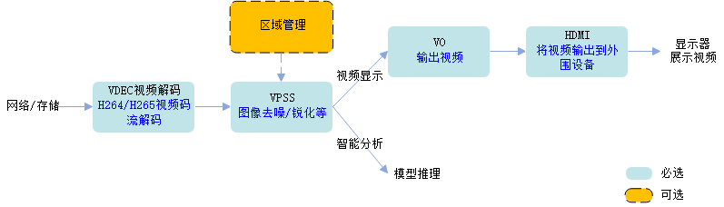

# readme<a name="ZH-CN_TOPIC_0000001073131184"></a>

### 本样例为大家学习昇腾软件栈提供参考，非商业目的！
### 本样例适配6.4.0及以上版本，支持产品为310B设备。


## 功能描述<a name="section09679311389"></a>

NVR，全称Network Video Recorder，即网络视频录像机，是网络视频监控系统的存储转发部分，NVR与网络摄像机协同工作，完成音频&视频的录像、存储及转发功能，同时，NVR具备本地人机交互界面、视频解码、视频显示及语音对讲功能。本sample主要实现了NVR视频业务处理功能。

## 原理介绍<a name="section19985135703818"></a>

NVR视频业务处理流程，包括下面两种：
1、视频解码显示流程
2、视频解码智能分析流程




## 目录结构<a name="section86232112399"></a>


```
├──————CMakeLists.txt       // 编译脚本
├──————include              // 示例代码头文件所在的目录
├──————src                  // 示例代码文件所在的目录
├──————stub                 // 示例代码桩函数文件所在的目录
```

## 环境要求<a name="section10528164623911"></a>

- 编译环境操作系统及架构：Ubuntu 18.04 x86\_64、Ubuntu 18.04 aarch64、EulerOS aarch64

- 编译器：g++ 或 aarch64-linux-gnu-g++

- 运行环境芯片：Ascend310B

- 已完成昇腾AI软件栈在开发环境、运行环境上的部署。


## 准备测试数据<a name="section13765133092318"></a>

请单击以下链接，获取该样例的测试视频数据。

[dvpp_vdec_h264_1frame_bp_51_1920x1080.h264](https://obs-9be7.obs.cn-east-2.myhuaweicloud.com/data/dvpp_sample_input_data/dvpp_vdec_h264_1frame_bp_51_1920x1080.h264)

## 编译运行

1. 以运行用户登录开发环境，编译代码。此时存在以下两种情况：
   1. 当开发环境与运行环境的操作系统架构相同时，例如两者都是X86架构，或者都是AArch64架构，此时编译流程参考如下：
        1. 设置环境变量。

            如下示例，$HOME/Ascend表示编译环境runtime标准形态安装包的安装路径，latest对应安装包版本号，请根据实际情况替换。

            ```
            export DDK_PATH=$HOME/Ascend/latest
            export NPU_HOST_LIB=$DDK_PATH/runtime/lib64/stub/
            ```
        2. 切换到nvr\_sample目录，依次执行如下命令执行编译。

            ```
            mkdir build
            cd build
            cmake .. -DCMAKE_CXX_COMPILER=g++ -DCMAKE_SKIP_RPATH=TRUE
            make
            ```
            在“nvr\_sample/build/“目录下会生成可执行程序nvr\_demo。

   2. 当开发环境与运行环境的操作系统架构不同时，例如开发环境是X86架构、运行环境是AArch64架构，此时涉及交叉编译，需要在开发环境安装包含AArch64工具链的软件包，并将相关环境变量指向AArch64版本路径，具体编译流程参考如下：
        1. 提前在x86_64编译环境安装x86_64版本的CANN-toolkit包
        2. 设置环境变量。

            如下示例，$HOME/Ascend表示编译环境runtime标准形态安装包的安装路径，latest对应安装包版本号，请根据实际情况替换。

            ```
            export DDK_PATH=$HOME/Ascend/latest
            export NPU_HOST_LIB=$DDK_PATH/runtime/lib64/stub/aarch64
            ```
        3. 切换到nvr\_sample目录，依次执行如下命令执行编译。

            ```
            mkdir build
            cd build
            cmake .. -DCMAKE_CXX_COMPILER=$HOME/Ascend/latest/toolkit/toolchain/hcc/bin/aarch64-target-linux-gnu-g++ -DCMAKE_SKIP_RPATH=TRUE
            make
            ```
            在“nvr\_sample/build/“目录下会生成可执行程序nvr\_demo。


2. 以运行用户将编译环境的“nvr\_sample/build/“目录下的可执行程序nvr\_demo以及测试数据拷贝到运行环境的同一目录下，例如“$HOME/dvpp/nvr\_sample“。

3. 运行应用。

   1. 切换到可执行文件nvr\_demo所在的目录，例如“$HOME/dvpp/nvr\_sample“，给该目录下的nvr\_demo文件添加执行权限。

      ```
      chmod +x nvr_demo
      ```

   2. 设置环境变量，请根据运行环境中runtime包的实际安装路径替换。

      ```
      export LD_LIBRARY_PATH=$HOME/Ascend/latest/runtime/lib64:$LD_LIBRARY_PATH/usr/lib64/
      ```

   3. <a name="li163081446761"></a>运行应用。

      

      -   test_type: 测试的功能类型
            -   0: user模式（视频解码智能分析流程）
            -   1: auto模式（视频解码显示流程）
      -   img_width: 输入视频图像的宽度。
      -   img_height: 输入视频图像的高度。
      -   auto_num: auto模式通道个数。
      -   user_num: user模式通道个数。
      -   out_width: 输出视频图像的宽度。
      -   out_height: 输出视频图像的高度。
      -   in_image_file: 视频文件名。
      -   send_usleep: 视频每一帧的处理间隔时间。
      -   rgn_param: 区域参数。
      -   write_file: 是否将处理后的视频图像做落盘处理。
      -   ref_num: 参考帧个数。
      -   display_num: 显示帧个数。
      -   crop_enable: 抠图开关。
      -   crop_width: 抠图宽度。
      -   crop_height: 抠图高度。
      -   crop_x: 抠图左上角横坐标。
      -   crop_y: 抠图左上角纵坐标。
      -   crop_mode: 抠图起始点坐标模式
            -   0: 绝对坐标
            -   1: 相对坐标
      -   aspect_ratio_width: 幅型比的宽，手动模式下生效。
      -   aspect_ratio_height: 幅型比的高，手动模式下生效。
      -   aspect_ratio_x: 幅型比的左上角横坐标，手动模式下生效。
      -   aspect_ratio_y: 幅型比的左上角纵坐标，手动模式下生效。
      -   aspect_ratio_mode: 幅型比类型
            -   0: 不使能幅型比
            -   1: 自动模式
            -   2: 手动模式
      -   bg_color: 幅型比背景颜色，需要填写16进制数，如: 0xFFEBCD。
      -   vpss_chn0_enable: vpss子通道0使能开关。
      -   vpss_chn1_enable: vpss子通道1使能开关。
      -   user_group_id: user模式创建的group起始id
      -   out_format: 输出格式(nv12, nv21)


## 单路user模式<a name="section56911075516"></a>

```
./nvr_demo --test_type 0 --img_width 1920 --img_height 1080 --write_file 1 --out_width 1920 --out_height 1080 --in_image_file dvpp_vdec_h264_1frame_bp_51_1920x1080.h264 --user_num 1

```

-   示例描述：从分辨率为1920\*1080、格式为h264的视频文件中解码视频流数据，并将解码后的视频流单帧数据按宽1920、高1080的图片保存。
-   输入视频：宽1920像素、高1080像素、格式为h264，名称为dvpp\_vdec\_h264\_1frame\_bp\_51\_1920x1080\.h264的视频文件。
-   输出图像：宽1920像素、高1080像素、格式为yuv420 planar nv12的图片。
-   本示例的通用参数说明关键参数说明如下：
    -   test\_type: user模式（视频解码智能分析流程）
    -   img\_width: 输入视频图像的宽度为1920
    -   img\_height: 输入视频图像的高度为1080
    -   write\_file: 解码后视频图片数据落盘处理
    -   out\_width: 输出视频图像的宽度为1920
    -   out\_height: 输出视频图像的高度为1080
    -   in\_image\_file: 视频文件名为“dvpp\_vdec\_h264\_1frame\_bp\_51\_1920x1080\.h264”
    -   user\_num: user模式通道个数为1个

## 单路user模式叠加马赛克<a name="section56911075516"></a>

```
./nvr_demo --test_type 0 --img_width 1920 --img_height 1080 --write_file 1 --out_width 1920 --out_height 1080 --in_image_file dvpp_vdec_h264_1frame_bp_51_1920x1080.h264 --user_num 1 --rgn_param 2:5:840:416:200:200:3:0:5:1040:616:100:100:3:0

```

-   示例描述：从分辨率为1920\*1080、格式为h264的视频文件中解码视频流数据，并且在指定区域打上两块马赛克，最后将打上马赛克的视频数据按宽1920、高1080的图片保存。
-   输入视频：宽1920像素、高1080像素、格式为h264，名称为dvpp\_vdec_h264_1frame_bp_51_1920x1080.h264的视频文件。
-   输出图像：宽1920像素、高1080像素、格式为yuv420 planar nv12的图片。
-   本示例的通用参数说明关键参数说明如下：
    -   test\_type: user模式（视频解码智能分析流程）
    -   img\_width: 输入视频图像的宽度为1920
    -   img\_height: 输入视频图像的高度为1080
    -   write\_file: 解码后视频图片数据落盘处理
    -   out\_width: 输出视频图像的宽度为1920
    -   out\_height: 输出视频图像的高度为1080
    -   in\_image\_file: 视频文件名为“dvpp\_vdec\_h264\_1frame\_bp\_51\_1920x1080\.h264”
    -   user\_num: user模式通道个数为1个
    -   rgn\_param: 区域参数。
-  rgn\_param（区域参数说明）：
“2:5:840:416:200:200:3:0:5:1040:616:100:100:3:0”数字依次含义：
区域个数:区域类型:马赛格左上角横坐标:马赛格左上角纵坐标:马赛克的宽:马赛克的高:马赛克的blk大小:区域图层编号....，后续参数按“区域类型:马赛格左上角横坐标..."格式顺序填写。

    - 区域个数: 叠加的区域个数
    - 区域类型: （影响后续参数的含义）
        - 5: 马赛克类型
        - 其他数字暂不支持
    - 马赛格左上角横坐标
    - 马赛格左上角纵坐标
    - 马赛克的宽
    - 马赛克的高
    - 马赛克的blk大小
        - 1：单个马赛克是8*8的正方形
        - 2：单个马赛克是16*16的正方形
        - 3：单个马赛克是32*32的正方形
        - 其他数字暂不支持
    - 区域图层编号：数字越大图层越高，马赛克图层编号支持0~3

## 单路auto模式<a name="section56911075516"></a>

```
./nvr_demo --test_type 1 --img_width 1920 --img_height 1080 --out_width 1920 --out_height 1080 --in_image_file dvpp_vdec_h264_1frame_bp_51_1920x1080.h264 --auto_num 1 --send_usleep 33000

```

-   示例描述：从分辨率为1920\*1080、格式为h264的视频文件中解码视频流数据，并将解码后的视频流通过hdmi输出到显示器上。
-   输入视频：宽1920像素、高1080像素、格式为h264，名称为dvpp\_vdec\_h264\_1frame\_bp\_51\_1920x1080\.h264的视频文件。
-   输出图像：宽1920像素、高1080像素、格式为yuv420 planar nv12的图片。
-   本示例的通用参数说明关键参数说明如下：
    -   test\_type: auto模式（视频解码显示流程）
    -   img\_width: 输入视频图像的宽度为1920
    -   img\_height: 输入视频图像的高度为1080
    -   out\_width: 输出视频图像的宽度为1920
    -   out\_height: 输出视频图像的高度为1080
    -   in\_image\_file: 视频文件名为“dvpp\_vdec\_h264\_1frame\_bp\_51\_1920x1080\.h264”
    -   auto\_num: auto模式通道个数为1个
    -   send\_usleep: 视频每一帧的处理间隔时间为33000us

## 单路auto模式+抠图<a name="section56911075516"></a>

```
./nvr_demo --test_type 1 --img_width 1920 --img_height 1080 --out_width 1920 --out_height 1080 --in_image_file dvpp_vdec_h264_1frame_bp_51_1920x1080.h264 --auto_num 1 --send_usleep 33000 --crop_enable 1 --crop_mode 0 --crop_x 700 --crop_y 300 --crop_width 700 --crop_height 600 --aspect_ratio_mode 2 --aspect_ratio_x 240 --aspect_ratio_y 134 --aspect_ratio_width 64 --aspect_ratio_height 64 --bg_color 0xFFEBCD

```

-   示例描述：从分辨率为1920\*1080、格式为h264的视频文件中解码视频流数据，并对解码后的视频做抠图功能，最后处理完成的视频流通过hdmi输出到显示器上。
-   输入视频：宽1920像素、高1080像素、格式为h264，名称为dvpp\_vdec\_h264\_1frame\_bp\_51\_1920x1080\.h264的视频文件。
-   输出图像：宽1920像素、高1080像素、格式为yuv420 planar nv12的图片。
-   本示例的通用参数说明关键参数说明如下：
    -   test\_type: auto模式（视频解码显示流程）
    -   img\_width: 输入视频图像的宽度为1920
    -   img\_height: 输入视频图像的高度为1080
    -   out\_width: 输出视频图像的宽度为1920
    -   out\_height: 输出视频图像的高度为1080
    -   in\_image\_file: 视频文件名为“dvpp\_vdec\_h264\_1frame\_bp\_51\_1920x1080\.h264”
    -   auto\_num: auto模式通道个数为1个
    -   send\_usleep: 视频每一帧的处理间隔时间为33000us
    -   crop\_enable: 使能抠图功能
    -   crop\_mode: 绝对坐标
    -   crop\_x: 抠图左上角横坐标为700 
    -   crop\_y: 抠图左上角纵坐标为300 
    -   crop\_width: 抠图宽度700
    -   crop\_height: 抠图高度600
    -   aspect\_ratio\_mode: 幅型比类型为手动模式
    -   aspect\_ratio\_x: 幅型比的左上角横坐标240
    -   aspect\_ratio\_y: 幅型比的左上角纵坐标134
    -   aspect\_ratio\_width: 幅型比的宽64
    -   aspect\_ratio\_height: 幅型比的高64
    -   bg\_color: 幅型比背景颜色
