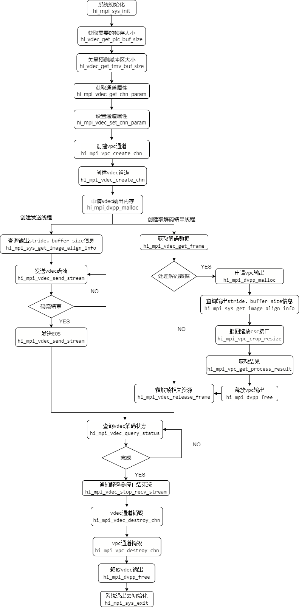

# readme<a name="ZH-CN_TOPIC_0000001072850082"></a>

### 本样例为大家学习昇腾软件栈提供参考，非商业目的！
### 本样例适配5.0.3及以上版本，支持产品为310P、310B设备。


## 功能描述<a name="section09679311389"></a>

VDEC+VPC的串联业务流程，本代码实现1080p H264解码，解码完成的数据传入VPC，进行抠图缩放加色域转换输出，抠图起点坐标(0, 0)，抠图输出192\*100，经过缩放，最终输出128\*128的RGB888图片。

## 原理介绍<a name="section19985135703818"></a>

样例中的关键接口调用流程如下：



## 目录结构<a name="section86232112399"></a>

```
├──————CMakeLists.txt        // 编译脚本
├──————demo.cpp              // 示例代码文件
```

## 环境要求<a name="section10528164623911"></a>

- 操作系统及架构：Ubuntu 18.04 x86\_64、Ubuntu 18.04 aarch64、EulerOS aarch64

- 编译器：g++ 或 aarch64-linux-gnu-g++

- 芯片：Ascend310P、Ascend310B

- 已完成昇腾AI软件栈在开发环境、运行环境上的部署。


## 准备测试数据<a name="section13765133092318"></a>

请单击以下链接，获取该样例的测试图片数据。

[dvpp_vdec_h264_1frame_bp_51_1920x1080.h264](https://obs-9be7.obs.cn-east-2.myhuaweicloud.com/data/dvpp_sample_input_data/dvpp_vdec_h264_1frame_bp_51_1920x1080.h264)

## 编译运行<a name="section3789175815018"></a>

1. 以运行用户登录开发环境，编译代码。此时存在以下两种情况：
   1. 当开发环境与运行环境的操作系统架构相同时，例如两者都是X86架构，或者都是AArch64架构，此时编译流程参考如下：
        1. 设置环境变量。

            如下示例，$HOME/Ascend表示编译环境runtime标准形态安装包的安装路径，latest对应安装包版本号，请根据实际情况替换。

            ```
            export DDK_PATH=$HOME/Ascend/latest
            export NPU_HOST_LIB=$DDK_PATH/runtime/lib64/stub/
            ```
        2. 切换到vdec\_vpc目录，依次执行如下命令执行编译。

            ```
            mkdir build
            cd build
            cmake .. -DCMAKE_CXX_COMPILER=g++ -DCMAKE_SKIP_RPATH=TRUE
            make
            ```
            在“vdec\_vpc/build/“目录下会生成可执行程序vdec\_vpc\_demo。

   2. 当开发环境与运行环境的操作系统架构不同时，例如开发环境是X86架构、运行环境是AArch64架构，此时涉及交叉编译，需要在开发环境安装包含AArch64工具链的软件包，并将相关环境变量指向AArch64版本路径，具体编译流程参考如下：
        1. 提前在x86_64编译环境安装x86_64版本的CANN-toolkit包
        2. 设置环境变量。

            如下示例，$HOME/Ascend表示编译环境runtime标准形态安装包的安装路径，latest对应安装包版本号，请根据实际情况替换。

            ```
            export DDK_PATH=$HOME/Ascend/latest
            export NPU_HOST_LIB=$DDK_PATH/runtime/lib64/stub/aarch64
            ```
        3. 切换到vdec\_vpc目录，依次执行如下命令执行编译。

            ```
            mkdir build
            cd build
            cmake .. -DCMAKE_CXX_COMPILER=$HOME/Ascend/latest/toolkit/toolchain/hcc/bin/aarch64-target-linux-gnu-g++ -DCMAKE_SKIP_RPATH=TRUE
            make
            ```
            在“vdec\_vpc/build/“目录下会生成可执行程序vdec\_vpc\_demo。

2. 以运行用户将开发环境的“build“目录下的可执行程序vdec\_vpc_demo以及[准备测试数据](#section13765133092318)中测试数据拷贝到运行环境（Host）的同一目录下，例如“$HOME/dvpp/vdec\_sample“。

3. 运行应用。

   1. 切换到可执行文件vdec\_vpc_demo所在的目录，例如“$HOME/dvpp/vdec\_vpc“，给该目录下的vdec\_vpc_demo文件加执行权限。

      ```
      chmod +x vdec_vpc_demo
      ```

   2. 设置环境变量。“$HOME/Ascend“表示runtime标准形态安装包的安装路径，请根据实际情况替换。

      ```
      export LD_LIBRARY_PATH=$HOME/Ascend/runtime/lib64
      ```

   3. <a name="li163081446762"></a>运行应用。

```
./vdec_vpc_demo
```

-   示例描述：本命令用于调用VDEC解码h264格式的码流，通过VPC转换得到RGB图片。
-   输入视频：宽1920像素、高1080像素、名称为“dvpp\_vdec\_h264\_1frame\_bp\_51\_1920x1080.h264”的码流。
-   输出图像：宽128像素、高128像素、名称为“vpc_output.rgb”格式为RGB888的图像。

