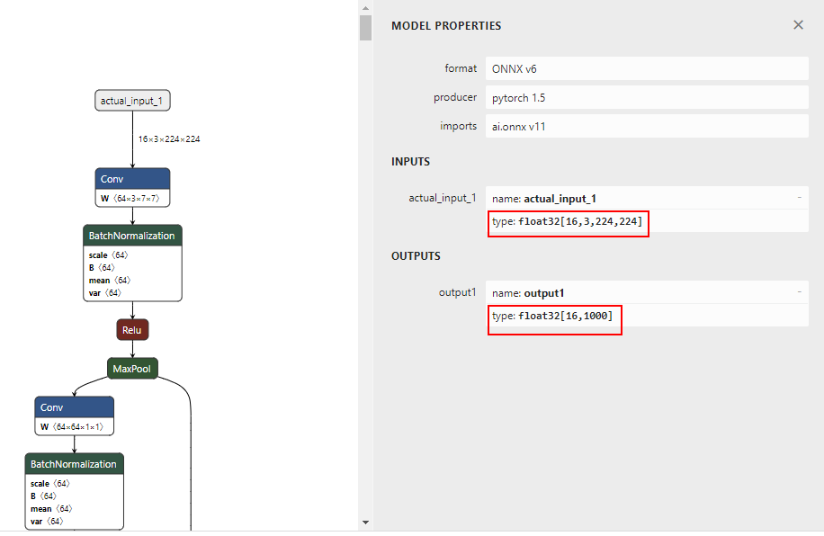

# AscendCL图片分类应用<a name="ZH-CN_TOPIC_0000001641068454"></a>
    
## 样例介绍

基于PyTorch框架的ResNet50模型，对\*.jpg图片分类，输出各图片所属分类的编号、名称。

**样例的处理流程如下图所示：**


## 样例下载<a name="section41941924142412"></a>

可以使用以下两种方式下载，请选择其中一种进行源码准备。

-   命令行方式下载（**下载时间较长，但步骤简单**）。

    ```
    # 开发环境，非root用户命令行中执行以下命令下载源码仓。    
    cd ${HOME}     
    git clone https://gitee.com/ascend/samples.git
    ```

    **注：**如果需要切换到其它tag版本，以v0.9.0为例，可执行以下命令。

    ```
    git checkout v0.9.0
    ```

-   压缩包方式下载（**下载时间较短，但步骤稍微复杂**）。

    ```
    # 1. samples仓右上角选择 【克隆/下载】 下拉框并选择 【下载ZIP】。     
    # 2. 将ZIP包上传到开发环境中的普通用户家目录中，【例如：${HOME}/ascend-samples-master.zip】。      
    # 3. 开发环境中，执行以下命令，解压zip包。      
    cd ${HOME}     
    unzip ascend-samples-master.zip
    ```

    **注：**如果需要下载其它版本代码，请在当前页面右上方按照下图切换版本。

    

**样例的代码目录说明如下：**

```
├── data         // 用于存放测试图片
├── model        // 用于存放模型文件
├── scripts       // 用于存放运行样例的脚本                                              
├── src          // 用于存放源码
```

## 准备环境<a name="section1835415517713"></a>

1.  安装CANN软件。

    单击[Link](https://hiascend.com/document/redirect/CannCommunityInstSoftware)，获取最新版本的CANN软件安装指南。

    **注意：**此处还可以在页面左上侧切换版本，查看对应版本的安装指南。

2.  设置环境变量。

    **注：**“$HOME/Ascend”请替换“Ascend-cann-toolkit”包的实际安装路径。

    ```
    # 设置CANN依赖的基础环境变量
    . ${HOME}/Ascend/ascend-toolkit/set_env.sh
    
    #如果用户环境存在多个python3版本，则指定使用python3.7.5版本
    export PATH=/usr/local/python3.7.5/bin:$PATH
    #设置python3.7.5库文件路径
    export LD_LIBRARY_PATH=/usr/local/python3.7.5/lib:$LD_LIBRARY_PATH
    
    # 配置程序编译依赖的头文件与库文件路径
    export DDK_PATH=$HOME/Ascend/ascend-toolkit/latest 
    export NPU_HOST_LIB=$DDK_PATH/runtime/lib64/stub
    ```

3.  安装OpenCV。

    执行以下命令安装opencv，**确保是3.x版本**：

    ```
    sudo apt-get install libopencv-dev
    ```

## 样例运行<a name="section012033382418"></a>

1.  **获取PyTorch框架的ResNet50模型（\*.onnx），并转换为昇腾AI处理器能识别的模型（\*.om）。**

    **注：**此处以昇腾310 AI处理器为例，针对其它昇腾AI处理器的模型转换，需修改atc命令中的--soc\_version参数值。

    ```
    # 为了方便下载，在这里直接给出原始模型下载及模型转换命令,可以直接拷贝执行。 
    cd $HOME/samples/inference/modelInference/sampleResnetQuickStart/python/model 
    wget https://obs-9be7.obs.cn-east-2.myhuaweicloud.com/003_Atc_Models/resnet50/resnet50.onnx 
    atc --model=resnet50.onnx --framework=5 --output=resnet50 --input_shape="actual_input_1:1,3,224,224"  --soc_version=Ascend310
    ```

    atc命令中各参数的解释如下，详细约束说明请参见[《ATC模型转换指南》](https://hiascend.com/document/redirect/CannCommunityAtc)。

    -   --model：ResNet-50网络的模型文件的路径。
    -   --framework：原始框架类型。5表示ONNX。
    -   --output：resnet50.om模型文件的路径。请注意，记录保存该om模型文件的路径，后续开发应用时需要使用。
    -   --input\_shape：模型输入数据的shape。
    -   --soc\_version：昇腾AI处理器的版本。

        >**说明：** 
        >如果无法确定当前设备的soc\_version，则在安装驱动包的服务器执行**npu-smi info**命令进行查询，在查询到的“Name“前增加Ascend信息，例如“Name“对应取值为_xxxyy_，实际配置的soc\_version值为Ascend_xxxyy_。


2.  **获取测试图片数据。**

    请从以下链接获取该样例的测试图片dog1\_1024\_683.jpg，放在data目录下。

    ```
    cd $HOME/samples/inference/modelInference/sampleResnetQuickStart/python/data 
    wget https://obs-9be7.obs.cn-east-2.myhuaweicloud.com/models/aclsample/dog1_1024_683.jpg
    ```

    **注：若需更换测试图片，则需自行准备测试图片，并将测试图片放到data目录下。**

3.  **运行样例。**

    执行以下脚本运行样例：

    ```
    cd $HOME/samples/inference/modelInference/sampleResnetQuickStart/python/scripts 
    bash sample_run.sh
    ```

    执行成功后，在屏幕上的关键提示信息示例如下，提示信息中的label表示类别标识、conf表示该分类的最大置信度，class表示所属类别。这些 值可能会根据版本、环境有所不同，请以实际情况为准：

    ```
    [INFO] The sample starts to run
    dog1_1024_683.jpg
    label:162  conf:0.902207  class:beagle
    *****run finish******
    ```

    图片结果展示：
    

## 代码逻辑详解<a name="section2231928389"></a>

**样例中的接口调用流程如下图所示。**


**在此样例基础上：**

-   **若想要更换测试图片**，只需自行准备好新的jpg图片并存放到样例的data目录下，图片数据预处理时会自动从该目录下读取图片数据、再缩放至模型所需的大小。
-   **若想要更换模型**，则需关注以下修改点：
    1.  准备模型：需自行准备好原始模型并存放到样例的model目录下，再参考[《ATC模型转换指南》](https://hiascend.com/document/redirect/CannCommunityAtc)转换模型；
    2.  图片数据预处理：根据新模型的输入要求进行预处理；
    3.  加载模型：在acl.mdl.load\_from\_file接口处加载转换后的模型；
    4.  准备模型输入/输出数据结构：根据新模型的输入、输出个数准备；
    5.  获取推理结果&后处理：根据新模型的输出数据进行后处理。


>**须知：** 
>一般来说，更换其它图片分类模型（例如resnet50-\>resnet101）,由于同类模型的输入、输出类似，在此样例基础上改动较小，但如果更换为其它类型的模型（例如目标检测模型），由于不同类型模型的输入、输出差别较大，在此样例基础上数据预处理、模型输入&输出准备以及数据后处理等改动很大，建议在[Ascend Sample仓](https://gitee.com/ascend/samples)先找到目标检测类的样例，再基于目标检测样例修改。


## 相关操作<a name="section27901216172515"></a>

-   获取更多样例，请单击[Link](https://gitee.com/ascend/samples/tree/master/inference/modelInference)。
-   获取在线视频课程，请单击[Link](https://www.hiascend.com/edu/courses?activeTab=%E5%BA%94%E7%94%A8%E5%BC%80%E5%8F%91)。
-   获取学习文档，请单击[AscendCL C&C++](https://hiascend.com/document/redirect/CannCommunityCppAclQuick)或[AscendCL Python](https://hiascend.com/document/redirect/CannCommunityPyaclQuick)，查看最新版本的AscendCL推理应用开发指南。
-   查模型的输入输出

    可使用第三方工具Netron打开网络模型，查看模型输入或输出的数据类型、Shape，便于在分析应用开发场景时使用。

    
